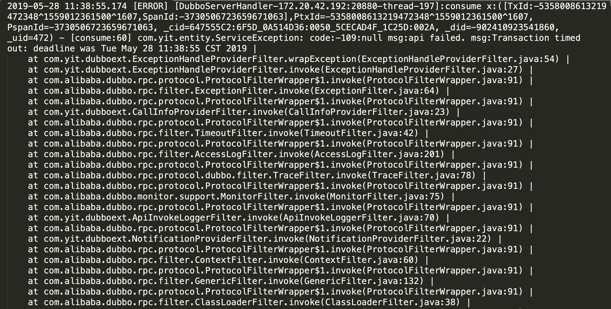
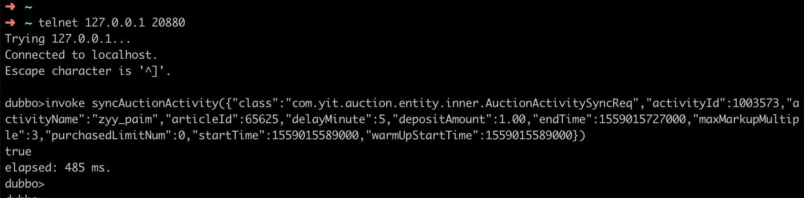
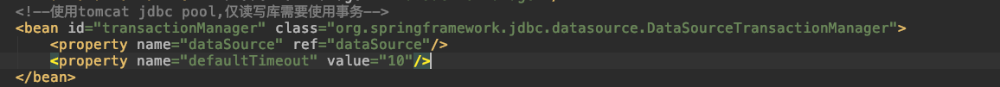
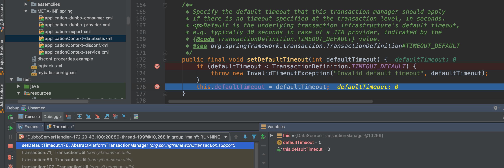
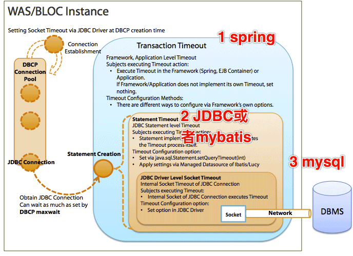
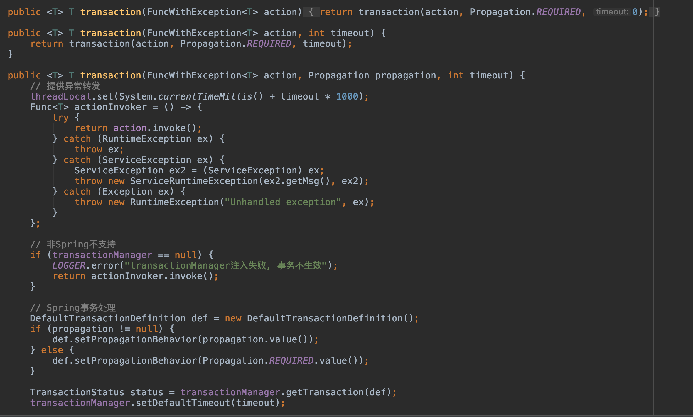

# Spring Transaction Analysize

### 问题描述

1. 前言 [20190525-Mybatis OGNL导致的并发安全问题](https://nbxjf.github.io/2019/05/28/ognl版本问题分析/) ，发生问题的mybatis版本为3.2.7，mybatis-spring的版本为1.2.2
2. 为解决OGNL的并发问题，将mybatis升级是3.4.0版本，mybatis-spring升级至1.3.0版本，但是此时发现稳定报错` Transaction time out`


<!-- more -->

### 排查过程

1. 在本地invoke method无法重现事务问题

   

2. 显示的声明defaultTimeout并不能规避`Transaction time out`报错

   

3. remote debug偶然发现有`setDefaultTimeout = 0`的操作

   

   * 堆栈信息发现来自TransactionUtil

   * 查看代码有设置默认timeout为0的操作

     ```Java
     public <T> T transaction(FuncWithException<T> action, Propagation propagation) {
             return transaction(action, propagation, 0);
         }
     ```

### 问题分析

1. 各种超时的关联

   

   

2. TransactionUtil中设置timeout的方法如下

   

   - timeout的默认值是0

   - 通过`transactionManager.setDefaultTimeout(timeout)`修改的是单例类的成员变量，这个操作是线程不安全的，修改的是一个共享变量，所以其他线程读取到的defaultTimeout被修改成0，导致transaction time out稳定重现。

   - 那么问题一直存在，为什么现在才被暴露呢？

     

3. 在mybatis-spring 1.3.0之前，如果选择DataSourceTransactionManager，事务内所有的sql操作必须通过JdbcTemplate执行才能使timeout设置正常工作，通过myBatis执行的sql操作将无法应用超时设置。原因是通过mybatis执行的sql操作，虽然会设置deadline，但是并不会去校验是否timeout。但是在jdbc操作中，会校验`applyTransactionTimeout`，所以timeout会传递给jdbc

   ```Java
   public static void applyTransactionTimeout(Statement stmt, DataSource dataSource) throws SQLException {
   		applyTimeout(stmt, dataSource, 0);
   	}
    
    
   public static void applyTimeout(Statement stmt, DataSource dataSource, int timeout) throws SQLException {
   		Assert.notNull(stmt, "No Statement specified");
   		Assert.notNull(dataSource, "No DataSource specified");
   		ConnectionHolder holder = (ConnectionHolder) TransactionSynchronizationManager.getResource(dataSource);
   		if (holder != null && holder.hasTimeout()) {
   			// 设置statment的超时时间
   			stmt.setQueryTimeout(holder.getTimeToLiveInSeconds());
   		}
   		else if (timeout > 0) {
   			// No current transaction timeout -> apply specified value.
   			stmt.setQueryTimeout(timeout);
   		}
   	}
   ```

   

4. 在mybatis-spring1.3.0版本中，`org.mybatis.spring.transaction.SpringManagedTransaction`中添加了`getTimeout`的校验，此时会调用`getTimeToLiveInSeconds`校验事务是否超时。

   ```java
   @Override
     public Integer getTimeout() throws SQLException {
       ConnectionHolder holder = (ConnectionHolder) TransactionSynchronizationManager.getResource(dataSource);
       if (holder != null && holder.hasTimeout()) {
         return holder.getTimeToLiveInSeconds();
       } 
       return null;
     }
   ```

   - 在`getTimeToLiveInSeconds`方法中，会校验当前事务是否超时
   - 该方法在mybatis-spring1.2.2中`getTimeout()`并不存在

   

### 解决方式

1. 观测到在注解中声明的timeout并不会修改defaultTimeout值并且作用于spring事务

   

2. 查看源码，会优先使用defination中设置的timeout，只有当TransactionDefinition中的timeout未设置或者等于`TransactionDefinition.TIMEOUT_DEFAULT`的时候，defaultTimeout才会生效

   ```Java
   /**
   	 * Determine the actual timeout to use for the given definition.
   	 * Will fall back to this manager's default timeout if the
   	 * transaction definition doesn't specify a non-default value.
   	 * @param definition the transaction definition
   	 * @return the actual timeout to use
   	 * @see org.springframework.transaction.TransactionDefinition#getTimeout()
   	 * @see #setDefaultTimeout
   	 */
   	protected int determineTimeout(TransactionDefinition definition) {
   		if (definition.getTimeout() != TransactionDefinition.TIMEOUT_DEFAULT) {
   			return definition.getTimeout();
   		}
   		return this.defaultTimeout;
   	}
   ```

3. 修改TransactionUtil中的代码，在`DefaultTransactionDefinition`声明当前事务的超时时间

   ```Java
           DefaultTransactionDefinition def = new DefaultTransactionDefinition();
           if (propagation != null) {
               def.setPropagationBehavior(propagation.value());
           } else {
               def.setPropagationBehavior(Propagation.REQUIRED.value());
           }
           def.setTimeout(timeout);
   
           TransactionStatus status = transactionManager.getTransaction(def);
   ```

   

### 参考文档

1. [事务超时]([http://www.heartthinkdo.com/?p=910](http://www.heartthinkdo.com/?p=910)) (理解spring、mybais、jdbc、myql各层超时时间的设置与作用)
